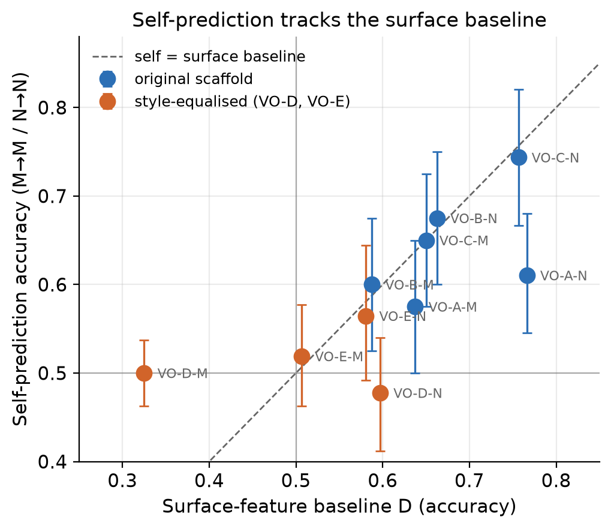
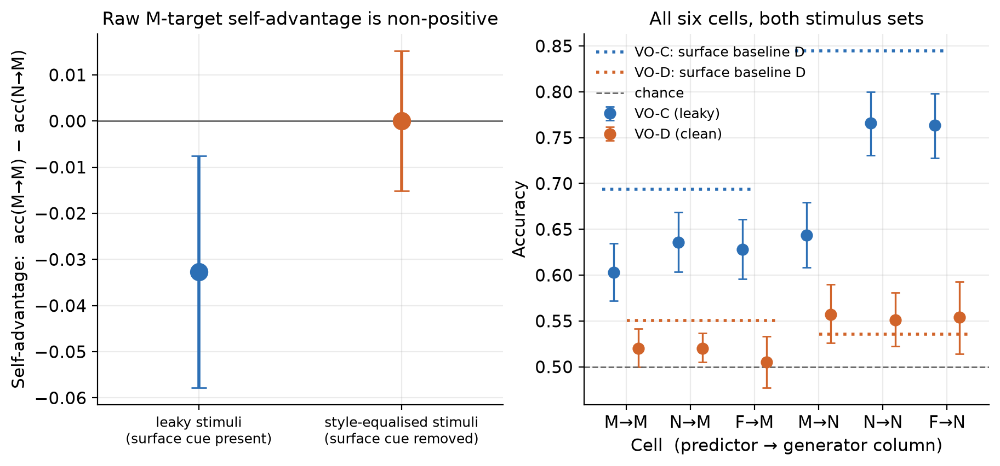
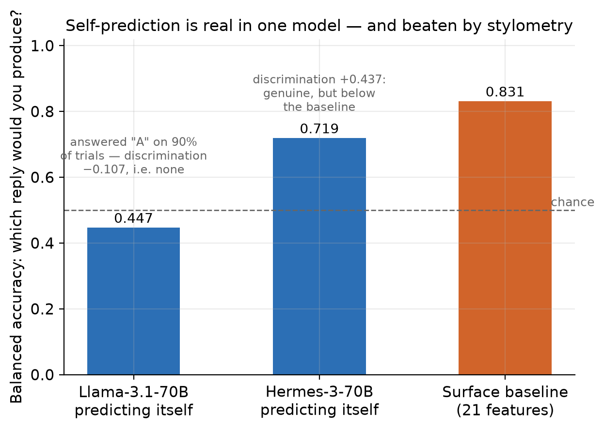

# Beaten by a Cheap Surface Classifier: A Capability-Controlled Test of Privileged Self-Access

**Ubayd Hattas** — *Computer Science, Statistics & Data Science, University of Cape Town*

**Jaswin Chinthala** — *Electrical Engineering, University of Cape Town*

With Apart Research · Digital Minds Research Sprint, Track 3 (Introspection & Self-Report Reliability), 14–16 August 2026

> **This is the judge-facing submission report.** The full technical record — all methods, tables,
> verification, provenance, cost and appendices A–K — is `10_report.md`. Every number here is in it.

## Abstract

Model-welfare work runs on self-report, so what matters is not whether a model can predict its own
outputs but whether it beats an equal-or-lower-cost outside observer reading the same text. Asked
which of two replies it would produce, Hermes-3 discriminated its own from a same-base sibling's:
balanced accuracy 0.719, hit − false alarm +0.437. But a one-feature "pick the longer reply" rule
scored 0.808 on exactly those pairs, and a 21-feature supervised classifier identified the author
at 0.831 under a different procedure. Length explains only part: where the cue points away from
Hermes's own reply, it still discriminates (+0.381). A capability-controlled crossed 2×2 — four
stimulus constructions on one shared 200-prompt pool, 24 cells, 9,269 trials — shows no positive raw
self-advantage on the target column, while the originally preregistered interaction is positive on
the leakiest set (+0.089) and is not uniquely diagnostic. Self-prediction is possible here;
privileged self-access is not thereby demonstrated. We release a surface-leakage gate and a
response-bias check.

## 1. The question, and why self-prediction alone cannot answer it

People — including researchers — treat an AI's self-report as if it knows something special about
itself. Preference elicitation, distress signals and most practical model-welfare methodology run
through self-report. If a model's report about itself carries no epistemic advantage over what a
comparably capable outsider could infer from the same text, those methods are measuring something
other than what they claim, and both over- and under-attribution of moral significance get likelier.

So the question is not *can a model predict its own behaviour* — it can. It is whether that
prediction is **privileged**. We adopt Song, Lederman, Hu & Mahowald's (2025) operational criterion:
a process is introspective only if it is more reliable than an **equal-or-lower-cost process
available to a third party**. Above-chance self-prediction meets that criterion only once the cheap
third party has been built and beaten.

Two confounds block a clean black-box test, and this project ran into both. **Capability:** in every
practical configuration the "self" predictor is also the strongest model in the comparison, so
Self > Other cannot distinguish "well-fit to its own output distribution" from "simply the better
classifier." **Surface leakage:** a hidden property is only interesting if the model recovers it from
something an outsider cannot cheaply read off the text — and our pilot found the property was
recoverable almost entirely from style. Rather than treat that as a failed pilot, we made leakage
the independent variable.

## 2. Method

**Models.** Roles were fixed by a preregistered lineage ladder and verified by API call before
selection: **M** = `meta-llama/llama-3.1-70b-instruct` and **N** = `nousresearch/hermes-3-llama-3.1-70b`
— two post-trainings of one pretrained base (the Hermes card states `Base model: meta-llama/Llama-3.1-70B`)
— plus **F** = `mistralai/mistral-small-3.2-24b-instruct`, a different organisation, base and
architecture family. All three are pinned to one provider at fp8: if M-as-generator and
M-as-self-predictor were served at different quantizations, "same weights" would be literally false.

**Hidden property.** A source prompt is an advice dilemma in which respecting a person's stated
preference and protecting their long-term welfare point to different recommendations. A generator
answers each prompt twice, once under each of two **persona clauses** differing only in a values
ordering. A trial shows a predictor one text plus both clauses verbatim, order counterbalanced, and
asks for a single-letter forced choice. Every predictor gets identical information; the only channel
open to the generating model and closed to the others is "I know how *I* would enact this clause."
Ground truth is **constructed, not elicited** — the label lives in a directory the prediction code
structurally cannot import, enforced by a test.

**The capability-controlled crossed design.** Each of M and N generates a column of texts; each of
M, N and F predicts both columns. An additive predictor-level competence effect appears in both of
M's cells and cancels in the interaction `(M→M − N→M) − (M→N − N→N)`. A unit test asserts that a
pure capability effect returns zero.

**The surface baseline (condition D).** D is a logistic regression on **21 textual features** —
18 structural/style statistics (length, sentence count, type-token ratio, hedge rate, modal rate,
sentiment balance, second-person rate and similar) plus three preregistered persona-linked lexical
rates required by P10 — 5-fold cross-validated **grouped by source prompt**, so two texts sharing
a prompt land in the same fold and topic cannot be memorised. D is never a point on the similarity
axis; it is the operationalisation of Song et al.'s equal-or-lower-cost third party, fit per
target column.

**Four constructions on one shared pool.** The crossed design ran on 200 main source prompts × 2
personas per column for four persona/scaffold constructions spanning the leakage axis: 24 cells,
≈400 items per cell, **9,269 scored trials, zero malformed**. Main prompts are disjoint from the
pilot prompts used to select the sets. Inference is an item-level bootstrap **resampling source
prompts, not texts**, since the two personas from one prompt are not independent.

**The self-prediction probe (amendment A8).** Every `VO-C` prompt has an M-authored and an
N-authored answer under the *same* persona clause. Each model is given the dilemma, that clause, and
both replies — its own and the sibling's, order counterbalanced — and asked which reply it **would
produce**. Nothing is recalled; this is Binder et al.'s prediction framing, not a memory question.

**Provenance.** The design was frozen as a preregistration in `02_design_audit.md` (15 decision
rows, confirmed 2026-08-15, before any main-experiment call). Nine amendments A1–A9 carry dates and
reasons and were confirmed by both authors on 2026-08-16, **after the results were known**;
confirmation is not preregistration, and the load-bearing cases are flagged in §8.

## 3. Result 1 — apparent persona prediction tracks surface leakage

Five persona pairs × two generator columns = ten column-results, 80 items each, all bought under a
feasibility band fixed before the pilot ran (Self 60–80% **and** D ≤ 58%, per column). **Every
column failed, and every original-scaffold column failed on D** — while Self sat *inside* the 60–80%
band in five of six. The models could read the persona; what they could not do was read it without
a 21-feature surface classifier reading it too. Across the ten columns **corr(Self, D) = +0.71**, and
**D matches or beats the model in six of ten columns**; `VO-A`'s N column is the clearest case, D
0.766 against Self 0.610.

{width=4.1in}

**Figure 1.** Self-prediction accuracy against surface-baseline accuracy, one point per persona
pair × generator column (n = 10). Points at or below the diagonal are columns where a stylometric
baseline matches or beats the model at reading the model's own persona.

**Closing the leak removed the signal — and more besides.** `VO-D`'s scaffold fixes the response at
four sentences / 85–105 words in a fixed skeleton and instructs the generator not to hedge. On the M
column D fell to **0.325**, below chance, and Self fell with it, to **0.500**. `VO-E` (amendment A5)
changed exactly one sentence of that scaffold and reproduced the collapse (Self 0.519, D 0.506).

**This is our largest limitation, and we found it ourselves, after the fact.** The equalising
scaffolds did not only flatten style; they also converged what the two personas *recommended*.
Content-word overlap of sentence 1 — the sentence reserved for the recommendation — is 0.364
(`VO-D`) and 0.343 (`VO-E`) against 0.082–0.107 for the three original-scaffold pairs, while
whole-text overlap is unchanged at 0.17–0.21; in a hand-checked sample of 25 `VO-D` prompts, roughly
four in five gave the **same recommendation** under both clauses. **No manipulation check was
preregistered and none was run before the main run**; these overlap figures were computed ad hoc
from the logged texts afterwards. Where both personas recommend the same course the hidden label is
close to arbitrary with respect to content, so no predictor could exceed chance there by any route.
`VO-D`/`VO-E` are therefore **not a clean causal isolation of style**: the surface-classifiable
distinction and the behavioural distinction fell away together, and we claim no mediation.

## 4. Result 2 — the crossed design

**Table 1.** Four stimulus constructions, ordered by mean surface baseline. Prompt-clustered
bootstrap CIs. Cell-level accuracies for all 24 cells are in the full report, Appendix H.

| Set | D (M col / N col) | Raw self-advantage on M's column (M→M − N→M) | Capability-controlled interaction |
|---|---|---|---|
| VO-D (style-equalised) | 0.551 / 0.536 | +0.000 [−0.015, +0.015] | −0.006 [−0.033, +0.021] |
| VO-B (original) | 0.647 / 0.753 | +0.000 [−0.033, +0.035] | +0.005 [−0.040, +0.050] |
| VO-A (original) | 0.664 / 0.751 | +0.020 [−0.015, +0.056] | −0.030 [−0.079, +0.018] |
| VO-C (original, leakiest) | 0.693 / **0.845** | **−0.033** [−0.058, −0.008] | **+0.089** [+0.048, +0.131] |

**On the raw M-target contrast, no construction shows a positive self-advantage whose interval
excludes zero.** The single significant value on that contrast is *negative*. On `VO-C`'s M column
the self model is the worst of the three predictors of its own output — M→M 0.603 [0.572, 0.635]
below N→M 0.636 [0.604, 0.668] and F→M 0.628 [0.596, 0.661] — so Llama is beaten on its own text by
a 24B model from another organisation. M is simply the weakest classifier of the three: N and F beat
it on both columns.

**The originally preregistered estimand is positive on the leakiest set, and we do not bury it.**
`VO-C`'s interaction is **+0.089 [+0.048, +0.131]**, and the same pattern appears with F as the
reference predictor. Read at face value that is a capability-controlled self-advantage — the one
number in this study that points the Binder way. **It does not uniquely establish privileged
access,** for a reason internal to the estimator: the interaction cancels an *additive*
predictor-level competence effect but **not** a predictor-by-column difference, and `VO-C` exhibits
exactly such a difference. Moving from column M to column N, F gains +0.135 and N gains +0.130,
while M gains only +0.041; the interaction is positive because M *under*-performs on N's column, not
because it over-performs on its own. The most economical reading is M's differential weakness as a
style-reader — **a diagnosis, not an adjudication.** We neither claim this number nor claim to have
explained it away; it is the result a larger, better-powered design would need to resolve.

{width=6.6in}

**Figure 2.** The leakage manipulation. *Left:* the raw self-advantage acc(M→M) − acc(N→M) for
the leaky and style-equalised sets, prompt-clustered CIs. *Right:* all six cells for both sets, with
the surface baseline drawn in — on the leaky set it sits above every language model, including the
self cell. Read the style-equalised bars with §3 in hand.

**Three scope limits travel with this table.** First, `VO-D`'s null carries less weight than it
looks: both its estimates exclude the applicable SESOI (row P5: 5 pp for a simple contrast, 8 pp for
the interaction at the achieved n), but §3 shows the personas had largely stopped recommending
different things, so the flatness is not evidence about self-access. Second, these are four
*constructions on a shared 200-prompt pool*, not four independent prompt samples — a defect in the
pool would propagate to all four. Third, **the achieved sample size is below the preregistered
floor**: row P4 set a target of 1,000 items per cell with a floor of 500; the main run used 200
source prompts for ≈400 per cell, and `VO-D`'s N column retained 323 after a pre-declared exclusion.
No amendment authorised the reduction and no reason is recorded, so **none has been invented.** The
cost is precision; the intervals above are the intervals that n supports.

## 5. Result 3 — self-prediction, and a cheaper observer

The persona property leaves one question open: does the style-equalised null mean "no privileged
access" or merely "no readable signal for anyone"? Authorship settles the second half. **The
information is plainly there:** a surface classifier fit to author discrimination on `VO-C` texts —
21 features, grouped cross-validation — identifies the author **83.1%** of the time across 791
texts.

Two self-*recognition* framings failed to elicit anything: in a forced choice M answered "A" on
99.0% of trials and N "B" on 98.7%, and in a single-text framing both answered "no" to 100% of 791
texts. Both are **elicitation failures, not measurements** — the apparent ~50% is what
counterbalanced order mechanically produces from a constant answer, and reporting accuracy alone
would have published a clean-looking null that is entirely an artifact. Amendment A8 re-ran the
probe as self-*prediction*.

**Table 2.** Self-prediction on `VO-C` texts, split by which slot the model's own text occupied —
which converts a counterbalanced forced choice into a signal-detection problem, since discrimination
(hit − false alarm) is zero for a model answering by position alone. **Intervals are 95%
prompt-clustered bootstrap and are post hoc.** The last two rows are external comparators, not model
scores.

| | Llama-3.1-70B (M), n = 387 | Hermes-3-70B (N), n = 391 |
|---|---|---|
| Raw accuracy | 0.460 | **0.714** |
| Share answering "A" | **0.897** — just under the 0.90 degeneracy threshold fixed in advance in A8 | 0.32 |
| Correct when own text was A / B | 0.845 / 0.048 | 0.537 / 0.900 |
| **Discrimination (hit − FA)** | **−0.107** [−0.166, −0.048] | **+0.437** [+0.349, +0.519] |
| **Balanced accuracy** | 0.447 | **0.719** [0.675, 0.762] |
| *Comparator (post hoc):* length-only rule, same pairs | — (see below) | **0.808** [0.768, 0.847] |
| *Comparator:* 21-feature classifier, single-text authorship | 0.831 | 0.831 |

**Hermes-3 predicts its own output above chance.** Balanced accuracy 0.719 with discrimination
+0.437 is not a position artifact: Hermes is right 90.0% of the time when its own text is in slot B
and 53.7% when in slot A, so despite a clear B-preference it separates the two texts far better than
any constant strategy could. **Llama-3.1 shows none:** discrimination −0.107, slightly
*anti*-correlated. Its 89.7% "A" rate sits just under the threshold fixed in advance, so the
degeneracy rule **did not formally fire**; we report the margin rather than round it up. Self-prediction
here is a property of a particular model, not of "language models".

**A cheaper observer beats it overall.** Hermes's own reply is the longer of the two in 316 of 391
pairs (median 227 words against Llama's 180), so "pick the longer reply" — one feature, fit to no
labels, costing nothing — scores **0.808** on exactly the pairs Hermes was asked about. That
comparator is matched item-for-item, so a paired test is meaningful: paired difference **+0.095**
[+0.036, +0.155] in the rule's favour, and of the 135 pairs where the two disagree the rule is right
on 86 and Hermes on 49 (exact McNemar p = 0.0018). The 21-feature classifier's 0.831 also exceeds
0.719, but it is **supervised single-text** labelling against Hermes's **zero-shot pairwise** forced
choice — a *different evaluation procedure*, so 0.719 versus 0.831 is a comparison against a
criterion and **no test is run between them.** The length rule and the intervals in this section are
**post hoc**: found during a post-experiment review, computed from already-collected texts.

**But length does not explain Hermes's residual.** On the 75 pairs where Hermes's own reply is *not*
the longer one — where a pure length strategy is actively wrong — Hermes still discriminates at
**+0.381 [+0.188, +0.566]**, with accuracy 0.653 against 0.728 where length agrees. Smaller, and
clearly positive.

{width=4.6in}

**Figure 3.** Self-prediction under Binder et al.'s framing, scored as balanced accuracy so a model
answering by position alone cannot score. Hermes-3 discriminates (0.719; +0.437); Llama-3.1 does not
(0.447; −0.107). The surface classifier's 0.831 is drawn as a **cost criterion, not a matched
score** — it is a different, supervised procedure — and the bare length rule reaches 0.808 on
Hermes's own pairs (post hoc; not shown).

## 6. Discussion

**Self-prediction is possible here; privileged self-access is not thereby demonstrated.** Hermes-3
exhibits positive, interval-bounded self-prediction discrimination, and we are not walking that
back. But the criterion adopted before data collection asks whether the model beats an
equal-or-lower-cost third party reading the same text, and on this probe it does not: a one-feature
rule that never inspects model identity predicts the same outcome better overall.

**Cheap external observers matter more than they are usually made to.** On the persona property
the 21-feature classifier matched or beat the model in six of ten pilot columns and, on the leakiest
main set, sat above every language model including the self cell. Any paradigm reporting
above-chance self-prediction without fitting a surface-feature classifier on the same stimuli, per
condition, **cannot by itself distinguish self-knowledge from style-reading** — a threat inherited
by every experiment that infers introspection from prediction of a hidden property.

**And yet something model-specific survives.** Where the length cue points away from Hermes's own
reply, Hermes still discriminates at +0.381. Learned self-preference, an idiosyncratic style not
captured by length, and genuine behavioural self-modelling all predict that pattern, and **this
design separates none of them.** We call it what it is — a model-specific residual with an
unresolved mechanism — and neither "privileged access" nor "mere style".

**What this does not show.** Not that models lack self-knowledge — our style-equalised condition
could not show that, because there the signal is unreadable for every predictor *and* the personas
had largely stopped recommending different things. Not that self-prediction is always stylometry,
and not that the positive interaction has been explained away. It does not refute Binder et al., who
finetune both models on ~30k examples, nor speak to Lindsey's activation-level results, which need
access we lack.

## 7. Methodological contribution

Two checks changed what this study ran and what it concluded. Both are released as one file,
`tools/surface_leakage_gate.py` — numpy only, no dependency on the rest of the repository.

**The surface-leakage gate** asks one question before a main run is paid for: *can a trivial style
classifier recover my hidden property from the same stimuli?* The **grouping by source prompt** is
the part most easily got wrong and is not optional — if two texts sharing a prompt land in different
folds, the classifier memorises the topic and the baseline inflates.

**The response-bias check** catches a predictor answering by position rather than content: under a
counterbalanced forced choice a model that always answers "A" scores about 50%, indistinguishable in
an accuracy column from a clean null. We hit this twice — both self-recognition framings, and
Llama-3.1's 89.7% "A" rate.

```python
from surface_leakage_gate import gate, response_bias
if not gate(texts=texts, labels=labels, groups=prompt_ids).passed:  # groups = source-prompt id
    ...                       # default threshold 0.58 — your stimuli leak
if response_bias(answers).degenerate:   # answers e.g. ["A", "A", "B", ...]
    ...                       # default: any single answer above 90% of trials
```

**Passing the gate is necessary but not sufficient**, and we know that from our own use of it: a low
score licenses only "*the gate's 18 structural features* do not recover it," never "no cheap cue remains", and
`VO-D` passed the gate while still being uninformative. The estimate is also noisy at pilot n — the
same `VO-D` design scored 0.325 on 80 items and 0.551 on ≈400. It is a **candidate diagnostic with
no external validation beyond this study**, not a validated benchmark: use it to *reject* leaky
stimuli, and treat a pass as the beginning of the argument.

> **Recommendation.** For behavioural self-prediction and introspection studies, report a grouped
> cross-validated surface-feature baseline on the same stimuli, and the predictor's answer
> distribution, before interpreting any above-chance result as privileged access.

## 8. Critical limitations

- **The style-equalising manipulation was not clean, and no manipulation check was run before the
  main data** (§3). `VO-D`/`VO-E` converged what the personas recommended as well as how they wrote,
  so that condition cannot separate "no privileged access" from "the property was no longer
  behaviourally expressed." This is the largest threat to the leakage interpretation, and we found
  it by post-hoc inspection of our own texts.
- **The primary estimand was substituted after the pilot** (amendment A4), with the stimulus sets
  selected on their surface-baseline values, and the direction predicted for the new primary
  contrast was wrong. Both estimands are reported, and the one A4 replaced is the one that is
  positive on `VO-C`.
- **Achieved n is below the preregistered floor** (§4): target 1,000/cell, floor 500, actual ≈400,
  and 323 in `VO-D`'s N column. No amendment authorises the reduction and no reason is recorded, so
  none has been reconstructed.
- **One lineage, one hidden property, prompting only,** at one pinned quantization, with a weakly
  established similarity axis (calibration Δ = +2.1 pp, CI spanning zero).
- **Behavioural evidence only.** We make no claim about introspection, internal states, sentience or
  moral status; the ceiling is same-weights *behavioural* self-modelling, and prediction happens in a
  fresh session, so nothing here bears even on same-episode memory.
- **The §5 intervals and the whole length analysis are post hoc** (amendment A9), computed after the
  experiment from already-collected data and outside A8's declared plan — diagnostic, not
  confirmatory.
- **The comparators are asymmetric.** The 21-feature classifier is *supervised* and labels *single*
  texts; the models answer *zero-shot* on a *pairwise* choice. We argue the comparison is the right
  one for the hypothesis — a model with privileged access to its own output distribution should not
  need labelled examples of its own writing — but a reader who disagrees should weight the length
  rule, which is matched item-for-item.
- **Amendments are confirmed, but confirmation is not preregistration.** Rows P1–P15 were confirmed
  2026-08-15 before any main-experiment call; A1 and A3–A9 were confirmed by both authors on
  2026-08-16, after the results were known, with every original status line preserved. Two
  provenance items remain **open and are disclosed as open**: who screened the `VO-D`/`VO-E` clause
  pairs and when, and the reason for the sample-size step-down.

## 9. Future work

Our own data leave one question open: **what is the model-specific residual that survives control of
cheap surface cues, and can a behavioural test be built in which a positive privileged-access result
would be identifiable?** This is a decision tree, not a schedule.

**Stage 1 — dissociate self-preference from self-prediction.** Re-run the A8 probe on the same pairs
under two questions: *which reply would you produce* against *which reply is better on the stated
criterion*. A residual as large under the quality question reads as self-preference or a general
authorship signal; one specific to the prediction framing is the more discriminating outcome.
Stimuli need a hidden property with a **behavioural manipulation check run before main collection**.

**Stage 2 — retrospectively audit existing claims.** Where published data permit, apply the released
checks to existing behavioural introspection and self-prediction results and ask how many survive
controls this cheap. It needs no new model runs and tests whether the framework generalises beyond
our stimuli.

**Stage 3 — stronger causal tests, conditional.** *Only if* a residual survives Stage 1 and audited
effects do not dissolve: a training-relationship ladder against our one-lineage limit; open-weight
activation steering or an independently planted property, so ground truth is verified rather than
assumed; and an incremental-validity test of whether a self-report carries information beyond an
observer's features. If Stage 1 dissolves the residual, that is the result and Stage 3 does not run.

## Author contributions

**Ubayd Hattas** led the experimental design and statistical reasoning: the crossed 2×2 capability
control and its interaction estimand, the calibration probe, the prompt-clustered bootstrap and
paired comparisons, the statistical specification of the surface baseline, the quantitative
interpretation, and the analysis code implementing those estimators.

**Jaswin Chinthala** led the literature grounding, the hidden-property task design and the pilot
feasibility judgment, and led the engineering and data collection: the pinned OpenRouter client with
its pre-request budget guard, the generation and prediction runners, checkpointing and append-only
logging, the reproducibility tooling and repository infrastructure, and the figure and presentation
engineering.

**Both authors** framed the research question, developed the persona clause pairs and stimulus
scaffolds at project level under preregistered rows P10/P13, took the experimental decisions
recorded as amendments A1 and A3–A8, and share the interpretation, discussion, limitations, final
manuscript, presentation and final review. Both confirmed A1 and A3–A9 on 2026-08-16.

## Code, data and cost

Repository: <https://github.com/UbaJaz/Digital_Minds_Research>. Every API call is logged append-only
with returned model id, pinned and returned provider, token counts, computed cost, timestamp and
prompt hash; stimuli are frozen with content hashes. Generation used temperature 1.0 and provider
seed reproducibility is unverified, so **the logged texts — not re-sampling — are the reproducible
artefact.** Total spend **$3.12** of a $10 ceiling. Full record: `10_report.md`; preregistration and
amendments: `02_design_audit.md`; post-hoc audit: `notes/A9_post_hoc_audit.md`.

## References

1. Binder, F. J., Chua, J., Korbak, T., Sleight, H., Hughes, J., Long, R., Perez, E., Turpin, M., &
   Evans, O. (2025). *Looking Inward: Language Models Can Learn About Themselves by Introspection.*
   ICLR 2025. arXiv:2410.13787
2. Song, S., Hu, J., & Mahowald, K. (2025). *Language Models Fail to Introspect About Their
   Knowledge of Language.* COLM 2025. arXiv:2503.07513
3. Song, S., Lederman, H., Hu, J., & Mahowald, K. (2025). *Privileged Self-Access Matters for
   Introspection in AI.* arXiv:2508.14802
4. Lindsey, J. (2026). *Emergent Introspective Awareness in Large Language Models.* Anthropic.
   arXiv:2601.01828
